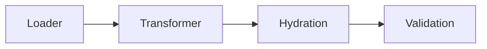

# Table of contents

- [Overview](#overview)
- [Loader](#loader)
  - [How loader selects a profile](#how-loader-selects-a-profile)
- [Transformer](#transformer)
- [Hydration](#hydration)
- [Validation](#validation)

## Overview

Thiran consist of module and each module has its responsibility. Following are the modules




## Loader

- This is responsible for loading the configuration from corresponding files
- Merge multiple configurations into one and merges the resultant config with environment variables
    - So the precedence is  `Environment variables > last config file > first config`
- Convert the keys into camel case
    - Note: All the keys are by default converted into camel case
- For example, consider the following two YAMLs
```yaml
# YAML-1
app:
    port: 3000
    log-levels: debug
```
```yaml
# YAML-2
app:
    log-levels: log
```
After merging, the merged config from loader is
```json
{
    "app": {
        "port": 3000,
        "logLevels": "debug"
    }
}
```

### How loader selects a profile

Loader requires the following

| Config Name | Description | Environment variable | Default Value |
| ----------- | ----------- | -------------------- | ------------- |
| Base Location | Folder where all the configuration files are available | `config.baseLocation` or `config.base-location` | `./config` (config folder in root) |
| Default configuration | Base/default configuration file | `config.location` | `application.yaml` |
| Additional configuration file location | Location of additional configuration files to be merged with default | `config.additionalLocation` or `config.additional-location` | `N/A` <br /> If additional values are to be provided, they must be  `,` separated file name. Note that the end file has more precedence that the first file |
|

## Transformer

- This is responsible for replacing value within `${}` with the actual value
- The value to be replaced can be either an environment variable or in config file
- Example for replacing a value from environment variable
    
```yaml
app:
    database:
        password: ${DB_PASSWORD}
```
After loading and transforming, the above config is changed to following 

```json
{
    "app": {
        "database": {
            "password": "password" # assuming process.env.DB_PASSWORD=password
        }
    }
}
```
- Example for referencing an existing path

 ```yaml
auth:
    base-path: https://auth-server
tenant:
    tenant-a: ${auth.base-path}/tenant-a # `${auth.basePath}/tenant-a` would also result in the value
```
After loading and transforming, the above config is converted to following
```json
{
    "auth": {
        "basePath": "https://auth-server"
    },
    "tenant": {
        "tenantA": "https://auth-server/tenant-a"
    }
}
```
Note that the config path is a dot separated key to be referred. The key can be either in kebab-case or came-case irrespective of the original key case.

## Hydration

- Hydration is particularly useful when computing the config based on other properties (e.g.) IAM DB authentication

- For such use cases, the configuration can be hydrated using beforeValidate hook

```ts
const configManager = new ConfigManager(validationSchema, { 
    // Both Sync and Async functions are supported    
    beforeValidate: async (config: Partial<Config>) => {
        const token = await getAccessToken()

        // hydrate config
        return { ...config, token }
}})
```

## Validation

- This happens after hydration
- This library supports any validation library that implements [Standard Schema](https://standardschema.dev/) interface for validation
- Validation schema is the only required constructor argument
