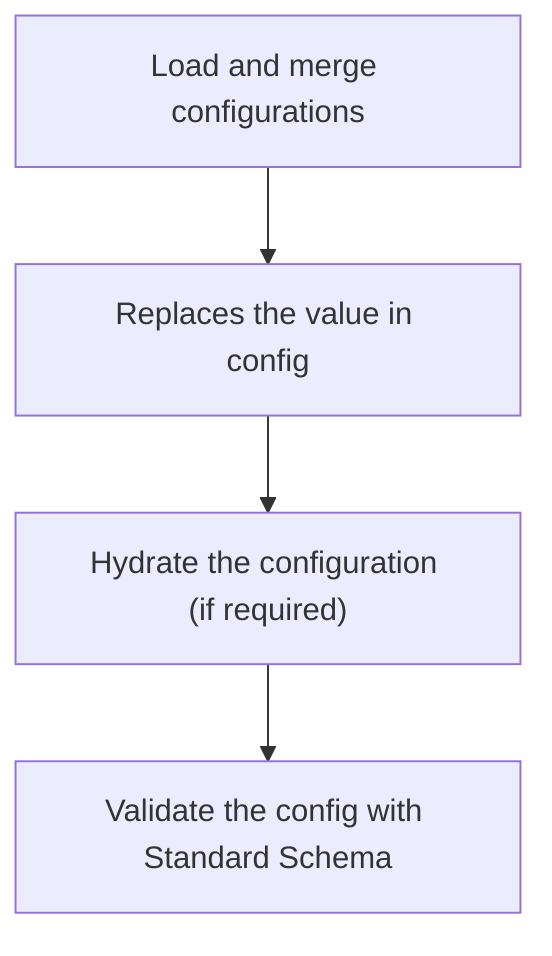
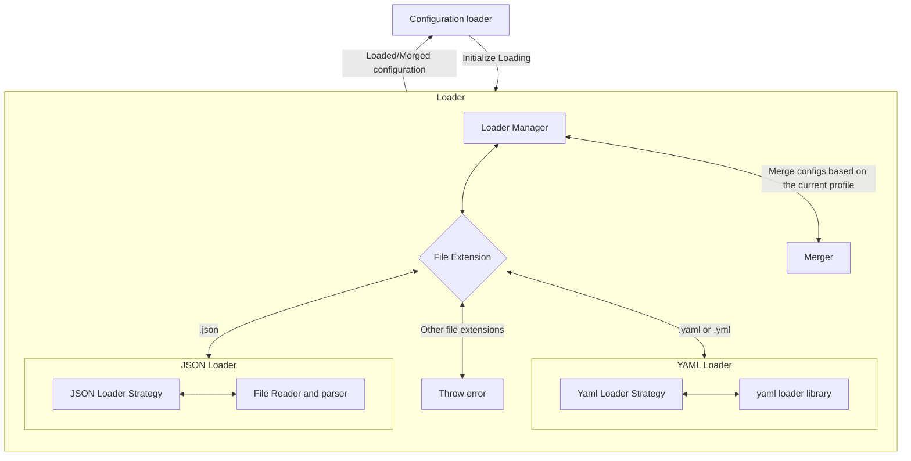

# Overview

Following is the overview of steps in this library



## Loader

- This is responsible for loading the configuration from corresponding files
- Merge multiple configurations into one
    - During merging, the last file always has the precedence over the first
- Camel case the Kebab case keys
- For example, consider the following two YAMLs
    ```yaml
    # YAML-1
    app:
        port: 3000
        log-levels: debug
    ```
    ```yaml
    # YAML-2
    app:
        log-levels: log
    ```
    After merging, the config looks like the following
    ```json
    {
        "app": {
            "port": 3000
            "logLevels": "debug"
        }
    }
    ```



