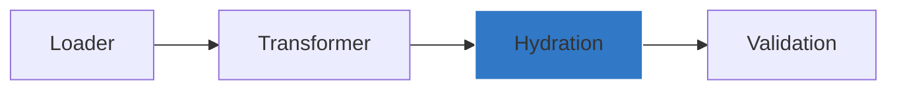

# Hydration



Hydration is particularly useful when computing the config based on other properties (e.g.) IAM DB authentication
For such use cases, the configuration can be hydrated using beforeValidate hook

```ts
const configManager = new ConfigManager(validationSchema, { 
    // Both Sync and Async functions are supported    
    beforeValidate: async (config: Partial<Config>) => {
        const token = await getAccessToken()

        // hydrate config
        return { ...config, token }
}})
```
