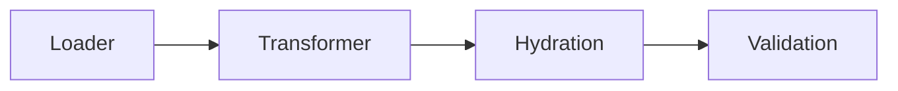

# Concepts

By default, configuration is considered as a nested object. 
This library has four main components.

```mermaid
flowchart LR

    Loader --> Transformer --> Hydration --> Validation
    
```

Each of them are described in the subsequent sections.