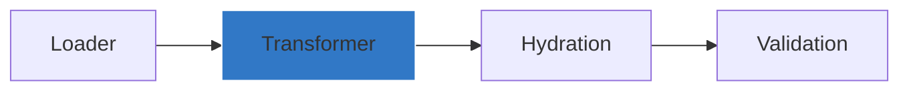

# Transformer



Transformer is responsible for replacing value within `${}` with the actual value.
The value to be replaced can be either an environment variable or a path from exiting config file with dot notation.

## Referencing env variable
```yaml
app:
    database:
        password: ${DB_PASSWORD}
```
After loading and transforming, the above config is changed to following

```json
{
    "app": {
        "database": {
            "password": "password" // assuming process.env.DB_PASSWORD=password
        }
    }
}
```
## Referencing existing config path

 ```yaml
auth:
    base-path: https://auth-server
tenant:
    tenant-a: ${auth.base-path}/tenant-a 
```
After loading and transforming, the above config is converted to following
```json
{
    "auth": {
        "basePath": "https://auth-server"
    },
    "tenant": {
        "tenantA": "https://auth-server/tenant-a"
    }
}
```
> [!TIP]
> The key in dot notation can be either in kebab-case, came-case or SCREAMING_SNAKE_CASE irrespective of the original key case.
> So, `auth.basePath` or `AUTH_BASE-PATH` or any other possible combination can be used although `auth.basePath`/`auth.base-path` is recommended.
