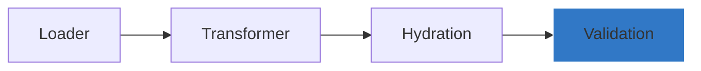

# Validation

```mermaid
flowchart LR

    Loader --> Transformer --> Hydration --> Validation

    style Validation fill:#3178c6,stroke:#ffffff
```

Validation happens after hydration. 
This library supports any validation library that implements [Standard Schema](https://standardschema.dev/) interface for validation
